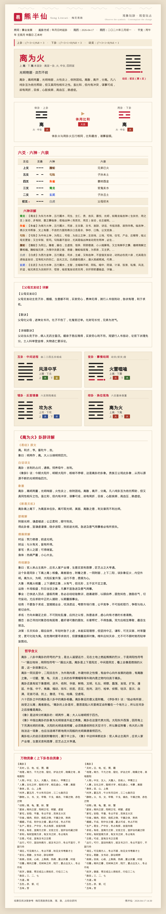

# 熊半仙 · 梅花易数 AI Skill

基于宋代邵雍《梅花易数》与小六壬的数字化占卜 AI 技能，适配 Claude Agent SDK / Cowork 的 `.skill` 生态。
支持 **年月日时起卦 / 数字起卦 / 汉字笔画起卦 / 小六壬起课** 四种方式，自动推演本卦、互卦、变卦、错卦、综卦，
判断体用五行生克关系，按起卦方式套用三套独立皮肤输出 HTML 卡片，**并自动生成精准裁剪的 2× Retina 长图 PNG**。



---

## 特性

- 📜 **四种起卦方式**：年月日时 / 数字 / 汉字笔画 / 小六壬
- 🎨 **三套独立皮肤**：
  - **A · 宋代文人**（年月日时）· 宣纸 + 绛色，云纹装饰
  - **B · 民俗木刻**（数字 / 笔画）· 米黄宣纸 + 暗朱双线 + 古金回纹
  - **C · 道符掐指**（小六壬）· 素笺 + 松柏墨青 + 八卦角章
- 🔌 **完全离线**：笔画查询使用 Unicode Unihan `kTotalStrokes`（93000+ 字内嵌），**不依赖百度 API**
- 🖼 **自动长图**：Playwright + headless Chromium 生成精准裁剪的 2× Retina PNG；CDN `modern-screenshot` 按钮兜底
- 🛡 **跨平台兼容**：macOS / Windows / Linux 均可运行；环境不支持时**静默降级**仅输出 HTML，主流程永不中断

---

## 安装到 Cowork / Claude Code

下载 [`熊半仙.skill`](./熊半仙.skill)，在 Cowork 里点击 "Save skill" 按钮即可。

---

## 直接运行（CLI）

### 一、环境准备（跨平台）

```bash
# 必需
pip install lunar_python

# 可选：自动长图（推荐）
pip install playwright
playwright install chromium

# 可选：笔画查询提速
pip install strokes
```

> Linux 系统 Python（PEP 668 保护）需追加 `--break-system-packages`。
> Windows / venv / conda 无需该参数。

### 二、起卦

```bash
cd xiongbanxian/scripts

# A · 年月日时（皮肤 A）
python3 divination.py --datetime "2026-04-19 17:30" --question "事业发展" \
  --output-html 事业.html
# 产出 事业.html + 事业.png

# B1 · 数字（皮肤 B）
python3 divination.py --numbers "168" --rule "规则1" --question "今日财运" \
  --output-html 财运.html

# B2 · 汉字笔画（皮肤 B）
python3 divination.py --numbers "事业发展" --stroke-variant simplified \
  --output-html 笔画.html

# C · 小六壬（皮肤 C）
python3 divination.py --xiaoliuren --datetime "2026-04-19 17:30" --question "何时能见到他" \
  --output-html 小六壬.html
```

### 三、预飞检 & 降级

```bash
# 预检当前环境是否支持自动长图
python3 xiongbanxian/scripts/screenshot.py --check
# [ok] ok                 → 环境 OK
# [skip] ...说明...        → 环境不支持；CLI 会自动跳过 PNG 仅输出 HTML

# 也可显式关闭长图
python3 divination.py --numbers "168" --output-html 财运.html --no-png
```

---

## 算法依据

**先天八卦数**：乾 1、兑 2、离 3、震 4、巽 5、坎 6、艮 7、坤 8

**年月日时公式**：
- 上卦 = (年支数 + 农历月 + 农历日) mod 8
- 下卦 = (年支数 + 农历月 + 农历日 + 时支数) mod 8
- 动爻 = (年支数 + 农历月 + 农历日 + 时支数) mod 6

**体用判定**：
- 动爻在下卦 → 体=上卦、用=下卦
- 动爻在上卦 → 体=下卦、用=上卦

**五行生克**（体 vs 用）：比和 / 用生体 → 大吉；体克用 → 小吉；体生用 → 小凶；用克体 → 大凶

详见 [`xiongbanxian/reference/algorithm.md`](./xiongbanxian/reference/algorithm.md)。

---

## 目录结构

```
xiongpanxian/
├── 熊半仙.skill              # Cowork 可安装的技能包
├── README.md
├── LICENSE
├── screenshots/             # 四张皮肤效果长图
│   ├── 皮肤A-宋代文人·年月日时起卦.png
│   ├── 皮肤B-民俗木刻·数字起卦.png
│   ├── 皮肤B-民俗木刻·笔画起卦.png
│   └── 皮肤C-道符掐指·小六壬.png
└── xiongbanxian/            # 技能源码
    ├── SKILL.md             # 给 AI 的技能说明
    ├── reference/algorithm.md
    └── scripts/
        ├── divination.py    # 起卦主入口（CLI + API）
        ├── render_card.py   # 三皮肤 HTML 渲染
        ├── screenshot.py    # 跨平台自动长图（Playwright）
        ├── strokes_util.py  # 离线笔画查询
        ├── data.py          # 卦象、五行、六神、六亲数据
        ├── data/unihan_strokes.json  # Unihan 笔画离线数据（~870KB）
        └── _hexagram_names*.py       # 64 卦卦辞详解（邵雍/傅佩荣解、断易天机 等）
```

---

## 皮肤一览

| 皮肤 | 起卦方式 | 主色调 | 预览 |
|---|---|---|---|
| A 宋代文人 | 年月日时 | 宣纸 `#FFFAF0` · 绛色 `#C41E3A` | [→](screenshots/皮肤A-宋代文人·年月日时起卦.png) |
| B 民俗木刻 | 数字 / 笔画 | 米黄 `#E8D9B0` · 暗朱 `#8B2518` · 古金 `#B8860B` | [→](screenshots/皮肤B-民俗木刻·数字起卦.png) |
| C 道符掐指 | 小六壬 | 素笺 `#D4CDAE` · 松柏墨青 `#2F4F3E` · 褐金 `#8B6F47` | [→](screenshots/皮肤C-道符掐指·小六壬.png) |

所有色板均通过 WCAG AA 对比度校验（正文 ≥ 4.5 : 1）。

---

## 技术栈

| 组件 | 说明 |
|---|---|
| `lunar_python` | 公历转农历、干支计算 |
| `Unihan kTotalStrokes` | Unicode 官方笔画数据（离线） |
| `Playwright` + `Chromium` | 服务端自动长图（可选） |
| `modern-screenshot` (CDN) | 浏览器端长图按钮（兜底） |
| 纯 CSS + SVG | 三皮肤装饰（无外部图片依赖） |

---

## 许可

MIT License — 见 [LICENSE](./LICENSE)。

> 占卜之术仅为决策参考，请以现实判断为据。
